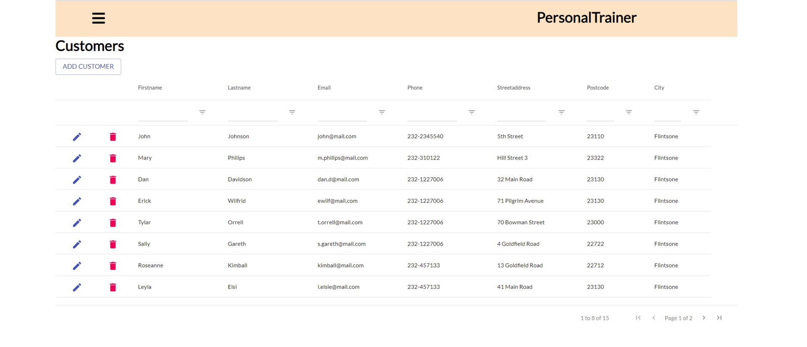

# Personal Trainer
Personal Trainer: The Last Exercise of the Course "Front End Programming" of Haaga-Helia UAS

<div id="top"></div>
<!--
*** Thanks for checking out the Best-README-Template. If you have a suggestion
*** that would make this better, please fork the repo and create a pull request
*** or simply open an issue with the tag "enhancement".
*** Don't forget to give the project a star!
*** Thanks again! Now go create something AMAZING! :D
-->

<!-- PROJECT SHIELDS -->
<!--
*** I'm using markdown "reference style" links for readability.
*** Reference links are enclosed in brackets [ ] instead of parentheses ( ).
*** See the bottom of this document for the declaration of the reference variables
*** for contributors-url, forks-url, etc. This is an optional, concise syntax you may use.
*** https://www.markdownguide.org/basic-syntax/#reference-style-links
-->
[![Contributors][contributors-shield]][contributors-url]
[![Forks][forks-shield]][forks-url]
[![Stargazers][stars-shield]][stars-url]
[![Issues][issues-shield]][issues-url]


<!-- PROJECT LOGO -->
<br />

<h3 align="center">Personal Trainer</h3>

  <p align="center">
    The Final Project for the Course "Front End Programming" of Haaga-Helia UAS
    <br />
    <a href="https://github.com/hffriman/PersonalTrainer"><strong>Explore the docs »</strong></a>
    <br />
    <br />
    <a href="https://github.com/hffriman/PersonalTrainer/issues">Report Bug</a>
    ·
    <a href="https://github.com/hffriman/PersonalTrainer/issues">Request Feature</a>
  </p>
</div>


<!-- TABLE OF CONTENTS -->
<details>
  <summary>Table of Contents</summary>
  <ol>
    <li>
      <a href="#about-the-project">About The Project</a>
      <ul>
        <li><a href="#introduction">Introduction</a></li>
        <li><a href="#screenshots">Screenshots</a></li>
        <li><a href="#built-with">Built With</a></li>
      </ul>
    </li>
    <li>
      <a href="#getting-started">Getting Started</a>
      <ul>
        <li><a href="#installation">Installation</a></li>
      </ul>
    </li>
    <li><a href="#roadmap">Roadmap</a></li>
    <li><a href="#contributing">Contributing</a></li>
    <li><a href="#contact">Contact</a></li>
  </ol>
</details>


<!-- ABOUT THE PROJECT -->
## About The Project

### Introduction

"Personal Trainer" was the final project of Front End Programming course. Each student were given the same task: to create a fictional personal trainer application that connects to the specific REST APIs for customers and their trainings, prints that data into separate pages (Customers and Trainings) and lets the user add, edit and delete all that data.

### What I FINISHED:

1. Connection to REST APIs
2. Printing of the Customer and Training data
3. Add, edit and delete functions for customers

### What I DID NOT FINISH:

1. Add function for new trainings
2. Delete function for trainings

### Screenshots

<div align="center">
   
   
   
   
   
   
   
   
</div>
<br>
<br>
<br>

   
### Built With

* [React JS](https://reactjs.org/)

<p align="right">(<a href="#top">back to top</a>)</p>


<!-- GETTING STARTED -->
## Getting Started

### Installation

1. Clone the repository
   ```sh
   git clone https://github.com/hffriman/Game-Art-Atelier.git
   ```
2. Install the node modules of the project
   ```sh
   npm install
   ```
3. Launch the app when you are ready:
    ```sh
    npm start
    ```

<p align="right">(<a href="#top">back to top</a>)</p>


<!-- ROADMAP -->
## Roadmap

Please see [open issues](https://github.com/hffriman/Game-Art-Atelier/issues) to find out the latest functionality wishes and issue reports.

<p align="right">(<a href="#top">back to top</a>)</p>


<!-- CONTRIBUTING -->
## Contributing

If you have any interests of making enhancements to this project, feel free to fork the repository and create a pull request.
If you have only ideas, don't worry: you can always share them by opening an issue with the tag "enhancement".
Your contribution, in any shape or form, will always be appreciated!

Please consider giving this project a star, as well. Thank you very much!

1. Fork the Project
2. Create your Feature Branch (`git checkout -b feature/AmazingFeature`)
3. Commit your Changes (`git commit -m 'Add some AmazingFeature'`)
4. Push to the Branch (`git push origin feature/AmazingFeature`)
5. Open a Pull Request

<p align="right">(<a href="#top">back to top</a>)</p>


<!-- CONTACT -->
## Contact

Henry Friman
  * Twitter: [@hffriman](https://twitter.com/@hfffennec)
  * Mail Adddress: henfriman.second@gmail.com
  * Link to My Profile: [https://github.com/hffriman](https://github.com/hffriman)
  * Link to this project: [https://github.com/hffriman/Game-Art-Atelier](https://github.com/hffriman/Game-Art-Atelier)

<p align="right">(<a href="#top">back to top</a>)</p>

<!-- ACKNOWLEDGMENTS -->
## Acknowledgments

* The structure of this documentation is based on the Best-README-Template:
  * https://github.com/othneildrew/Best-README-Template

<p align="right">(<a href="#top">back to top</a>)</p>

<!-- MARKDOWN LINKS & IMAGES -->
<!-- https://www.markdownguide.org/basic-syntax/#reference-style-links -->
[contributors-shield]: https://img.shields.io/github/contributors/hffriman/PersonalTrainer.svg?style=for-the-badge
[contributors-url]: https://github.com/hffriman/PersonalTrainer/graphs/contributors
[forks-shield]: https://img.shields.io/github/forks/hffriman/PersonalTrainer.svg?style=for-the-badge
[forks-url]: https://github.com/hffriman/PersonalTrainer/network/members
[stars-shield]: https://img.shields.io/github/stars/hffriman/PersonalTrainer.svg?style=for-the-badge
[stars-url]: https://github.com/hffriman/PersonalTrainer/stargazers
[issues-shield]: https://img.shields.io/github/issues/hffriman/PersonalTrainer.svg?style=for-the-badge
[issues-url]: https://github.com/hffriman/PersonalTrainer/issues
[license-shield]: https://img.shields.io/github/license/hffriman/PersonalTrainer.svg?style=for-the-badge
[license-url]: https://github.com/hffriman/PersonalTrainer/blob/master/LICENSE.txt
[product-screenshot]: images/screenshot.png
